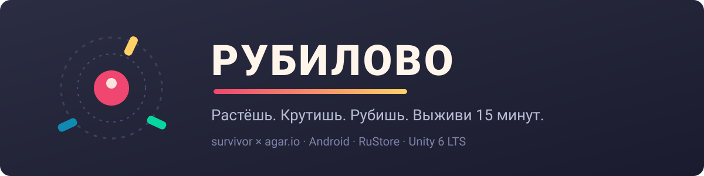

<div align="center">



**#1 игровой проект · survivor × agar.io · Android / RuStore**

[](https://github.com/electr0n4ik/no1-game-project/actions/workflows/tests.yml)


[](docs/spec/)

*Вид сверху. Человечек. Вокруг крутятся клинки и рубят толпы.*
*Собираешь XP — **растёшь**, как в agar.io: больше размер — шире орбита смерти.*

</div>

---

## 🎮 Ядро игры (v0.1)

| Система | Статус | Спека |
|---|---|---|
| Drag-джойстик с dead-zone, замедление от размера + скоростной пол 0.62 | ✅ код | [01 §2](docs/spec/01-core-gameplay.md) |
| 6 оружий × 5 уровней (клинки, кинжалы, топор, молния, аура, хлыст) | ✅ код | [01 §4](docs/spec/01-core-gameplay.md) |
| Эволюции через большой сундук босса (6 рецептов) | ✅ код | [01 §5](docs/spec/01-core-gameplay.md) |
| Бестиарий 6 типов + элиты ×6 HP + 4 босса по скрипту 4/8/12/15 мин | ✅ код | [01 §8–9](docs/spec/01-core-gameplay.md) |
| Wave Director: HP ×1.10/мин, кап 80→120, зум камеры `scale^0.43` | ✅ код | [01 §10](docs/spec/01-core-gameplay.md) |
| Экономика МЯСО 🍖 + анти-фарм декей + дерево статов 6×16 ступеней | ✅ код | [02](docs/spec/02-meta-progression.md) |
| Мягкая реклама: rewarded-ядро, interstitial с капами, app-open **выключен** | ✅ код | [04](docs/spec/04-monetization-analytics.md) |
| Выбор апгрейда 1-из-3 UI, боссы с телеграфами, сок/VFX | 🔜 M2 | [03](docs/spec/03-ui-ux-art-audio.md) |

## 📐 Библиотека спецификаций («на берегу»)

| Документ | Что внутри |
|---|---|
| [00 · Vision & Market](docs/spec/00-vision-market.md) | УТП, бенчмарки ($311M Survivor.io), KPI D1≥35%, роадмап M0–M4 |
| [01 · Core Gameplay](docs/spec/01-core-gameplay.md) | Все константы баланса в таблицах, каталоги оружия/врагов/боссов |
| [02 · Meta Progression](docs/spec/02-meta-progression.md) | Экономика faucet/sink 0.85, дейлики, streak, копилка |
| [03 · UI/UX/Art/Audio](docs/spec/03-ui-ux-art-audio.md) | Онбординг 30 сек, juice-чеклист, палитра, SFX |
| [04 · Monetization & Analytics](docs/spec/04-monetization-analytics.md) | Плейсменты с opt-in прогнозом, Remote Config схема, AppMetrica |

## 🧪 Верификация без редактора

Чистая логика (баланс, экономика, деки апгрейдов) живёт в
[`Assets/Scripts/Logic`](Assets/Scripts/Logic) без UnityEngine и гоняется тестами:

```bash
dotnet run --project tests/Logic.Tests   # 47 проверок против таблиц спек
```

Игровые MonoBehaviour проверяются stub-компиляцией (CI-совместимо):
все формулы подтверждены численно против спецификации.

## 🚀 Сборка APK

**Локально:** открыть проект в Unity 6.3 LTS → Build Settings → Android → Build.

**Через CI:** `Actions → release-apk → Run workflow`.
Нужны secrets: `UNITY_LICENSE` (+EMAIL/PASSWORD/TOTP) и ключ подписи
`ANDROID_KEYSTORE_*` — см. [SECURITY.md](SECURITY.md).

## 🛡 Монетизация — принципы

> Реклама как бонус, не как налог: никогда в бою, первая сессия чистая,
> interstitial ≤1/3 мин и со 2-й сессии, rewarded ≤8/день.
> Полные правила — [спека 04 §4](docs/spec/04-monetization-analytics.md).

## 📄 Лицензия

Код и ассеты проекта — [защитная лицензия](LICENSE.md): просмотр/форк для учёбы — да,
коммерческое переиспользование — нет. Kenney CC0-ассеты остаются public domain.

<div align="center">
<sub>Сделано соло · Unity 6.3 LTS · Yandex Mobile Ads · RuStore Console</sub>
</div>
